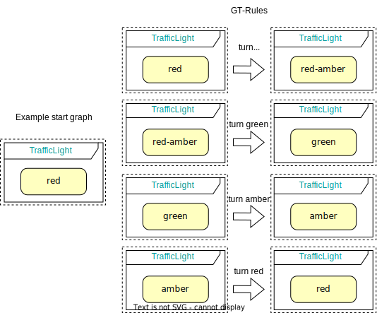
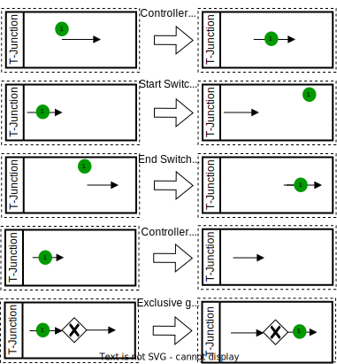

This repository contains our paper's sources and **additional artifacts**. The  has been **submitted for review** to ECMFA2023.

# Specification of the global behavior

## Groove specification

### State machine semantics

**Example start graph and GT rules for the traffic light:**



The full GT system in Groove is linked in the artifacts section [Groove specification](https://github.com/timKraeuter/Towards-behavioral-consistency-in-multi-modeling/blob/main/README.md#groove-specification-1).

### BPMN semantics

The mapping from BPMN to GT rules is described in more detail in the corresponding [wiki](https://github.com/timKraeuter/Rewrite_Rule_Generation/wiki).
The wiki describes the subset of implemented BPMN semantics and our comprehensive [test suite](https://github.com/timKraeuter/Rewrite_Rule_Generation/wiki/Test-Suite) to test our graph transformation rule generation, i.e., local HOT for BPMN.

**Example start graph and GT rules for the TJunction controller:**



The full GT system in Groove is linked in the artifacts section [Groove specification](https://github.com/timKraeuter/Towards-behavioral-consistency-in-multi-modeling/blob/main/README.md#groove-specification-1).

## Maude specification

A description how Maude specifications can be used in our approach is available [here](./artifacts/maude//Maude_Specification.pdf). 

### State machine semantics

**Rewriting rules and start configuration for a traffic light:**
```python
var X : String . --- Object id
--- Generated rules
rl [turn_red_amber] : < X : FSM | name : "trafficLight", state : "red" >
                   => < X : FSM | name : "trafficLight", state : "red-amber" > .
rl [turn_green] : < X : FSM | name : "trafficLight", state : "red-amber" >
               => < X : FSM | name : "trafficLight", state : "green" > .
rl [turn_amber] : < X : FSM | name : "trafficLight", state : "green" >
               => < X : FSM | name : "trafficLight", state : "amber" > .
rl [turn_red] : < X : FSM | name : "trafficLight", state : "amber" >
             => < X : FSM | name : "trafficLight", state : "red" > .
--- Generated initial config representing the start state of the FSM.
op initial : -> Configuration .
eq initial = < "1" : FSM | name : "trafficLight", state : "red" > .
```

### BPMN semantics

The Maude module is linked in the artifacts section [Maude specification](https://github.com/timKraeuter/Towards-behavioral-consistency-in-multi-modeling/blob/main/README.md#maude-specification-1).

### Check behavioral consistency

The Maude module is linked in the artifacts section [Maude specification](https://github.com/timKraeuter/Towards-behavioral-consistency-in-multi-modeling/blob/main/README.md#maude-specification-1).

# Discussion

## Support for new modeling languages
The [implementation](https://github.com/timKraeuter/Rewrite_Rule_Generation) contains our frameworks to generate and test Groove and Maude specifications alongside the HOTs for FSM and BPMN.
Furthermore, it contains the [comprehensive testsuite](https://github.com/timKraeuter/Rewrite_Rule_Generation/wiki/Test-Suite) to validate the BPMN HOT.

## State space explosion
A description how to run the **Maude benchmark** can be found [here](./artifacts/maude/benchmark/maudeBenchmark.md), while the description for the **Groove benchmark** can be found [here](./artifacts/graphGrammars/grooveBenchmark.md).

# Artifacts
The implementation which generated the Groove and Maude specifications can be found [here](https://github.com/timKraeuter/Rewrite_Rule_Generation).
## Use case models
All models from the use case can be found [here](./artifacts/use_case/README.md), including instructions on running the BPMN models online to understand their exeuction.

## Groove specification
- The Groove graph grammars for the **traffic light model** can be found [here](./artifacts/graphGrammars/trafficLight.gps/README.md), along with instructions on using it for state space generation.
- The Groove graph grammars for the **T-Junction controller** and **bus controller** can be found [here](./artifacts/graphGrammars/T-Junction.gps/README.md), along with instructions on using it for state space generation.
- The Groove graph grammars describing the **global system** can be found [here](./artifacts/graphGrammars/global.gps/README.md), along with instructions on using for state space generation and global consistency checking.

## Maude specification
- The Maude module for the **traffic light model** can be found [here](./artifacts/maude/trafficLight.maude), along with an [example execution](./artifacts/maude/trafficLight-output.txt).
- The Maude module for the **T-Junction controller** can be found [here](./artifacts/maude/tJunctionController.maude), along with an [example execution](./artifacts/maude/tJunctionController-output.txt).
- The Maude module for the **global system** can be found [here](./artifacts/maude/fullUsecase.maude).
  - Example execution for checking property (1) and (2) can be found [here](./artifacts/maude/prop1AndProp2-output.txt).
  - Example execution for checking property (3) with 2 incoming buses can be found [here](./artifacts/maude/prop3-output.txt).
  - Example execution for checking property (4) with 1 incoming bus can be found [here](./artifacts/maude/prop4-output.txt).

All models can be run by ```maude <model-file>``` if [Maude is installed](https://maude.lcc.uma.es/maude30-manual-html/maude-manualch2.html#x13-230002.1).
