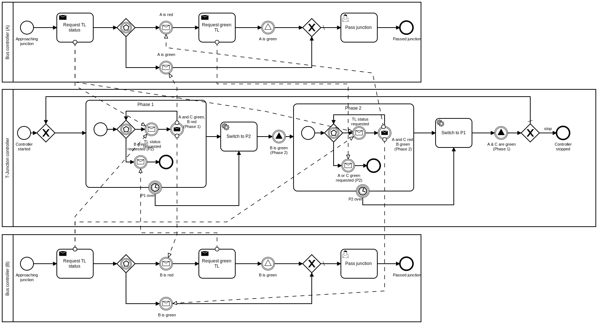

## Groove Prerequisites:
- Installed java (check with ```java -version```). Tested with version 1.8.0_301.

Run **Groove** by executing the following command in **this directory**:
```
java -jar ../groove-5_8_1/bin/Simulator.jar
```
Then load the example by clicking ```File < Load Grammar``` and selecting the following:
- **T-Junction.gps**

## State space generation
Using the generated production rules from the BPMN models, one can analyze different system configurations.

For example, we can analyze the T-Junction for one bus approaching from direction A.
With the corresponding start graph ```junction_with_bus_A``` we generate the state space using Groove (Consult the Groove demos in the further resources section if needed).
The following screenshot illustrates the state space (361 States, 744 transitions) generated by Groove.


By clicking on individual states, one can see the graph associated with that state. The rules are typed in the process snapshot metamodel, which serves as a type graph in Groove.

One of the three final states (states without outgoing transitions) is the following:


This state describes the situation in which the bus has successfully passed the junction, and the T-Junction controller stopped.
Analyzing the configuration when one bus approaches from direction B (see start graph ```junction_with_bus_B```) also leads to 361 States and 744 transitions.

If we generate the state space for two buses with directions A and B (see start graph ```junction_with_bus_A_and_B```), we get a state space of 7731 states and 24019 transitions.
One of the final states in this configuration is the following:


## Further resources:
- Groove Demo: [Basic functionality](https://www.youtube.com/watch?v=R2beaSQ9-NM).
- Groove Demo: [Editing Graphs and Rules](https://www.youtube.com/watch?v=R2beaSQ9-NM).
- Groove Demo: [Type Graphs](https://www.youtube.com/watch?v=LTGRS3AYSSM).

Feel free to contact me for further information.

## Interactive token simulation
One can run the BPMN models using the browser-based simulator (implemented by [bpmn.io](https://github.com/bpmn-io)).

- Go to the [BPMN simulator](https://bpmn-io.github.io/bpmn-js-token-simulation/modeler.html).
- Download the executable use case model from [here](../../use_case/bpmn-files/use-case-execution.bpmn?raw=true).
  
- Import the model into the simulator by dragging it into the browser.
- Spawn a T-Junction controller and buses by clicking on the respective start events of the processes.
- Enjoy the simulation.
