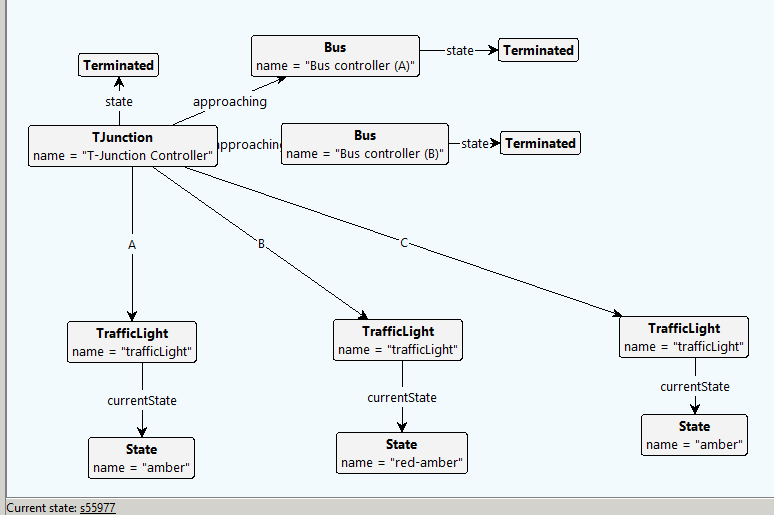

## Groove Prerequisites:
- Installed java (check with ```java -version```). Tested with version 1.8.0_301.

Run **Groove** by executing the following command in this directory:
```
java -jar ../groove-5_8_1/bin/Simulator.jar
```
Then load the example by clicking ```File < Load Grammar``` and selecting the following:
- **global.gps**

## State space generation
Using the generated production rules from the BPMN models, one can analyze different system configurations.

For example, we can analyze the T-Junction without buses while it interacts with the traffic lights.
With the corresponding start graph ```No_Buses_Property_1_and_2```, we generate the state space,
which has 168 states and 438 transitions (886 with graph conditions activated).

The final state (a state without outgoing transitions) is the following:


This state describes the situation in which the T-Junction controller stopped and
the traffic lights were just in phase 1, and are now ready to switch to phase 2.

Analyzing the T-Junction, with a bus approaching from direction B (start graph ```junction_with_B2```),
leads to a state space of 2888 states and 10046 transitions (17814 with graph conditions activated).

One of the three final states is the following:


This state describes the situation in which the bus B2 has successfully passed the junction,
and the T-Junction controller stopped.
The traffic lights are in phase 1 and ready to switch to phase 2.

The configuration with buses approaching from directions A and B
can be analyzed using the start graph ```junction_with_B1_and_B2```.
It leads to a state space of 61848 states and 279926 (448606 with graph conditions activated).

One of the nine final states is the following:



It is similar to the previously shown final states, but now two buses passed the T-Junction successfully.

## Behavioral consistency checking
The properties 1-4 were translated to the LTL-Syntax used by Groove:

**Property (1):**
```
G!((A_green | A_amber) & (B_green | B_amber))
```
**Property (2):**
```
G!((C_green | C_amber) & (B_green | B_amber))
```
To check properties 1 or 2, use the start graph ```No_Buses_Property_1_and_2``` for faster state space generation,
while for properties 3/4, one must use ```junction_with_B1```/```junction_with_B2``` or ```junction_with_B1_and_B2```.

**Property (3):**
```
G!(B1_passing & (A_red | A_red_amber))
```
**Property (4):**
```
G!(B2_passing & (B_red | B_red_amber))
```
One can check the properties in the following way:
- Activate the graph conditions, which will provide the atomic propositions needed for model-checking. You select all graph conditions and click on the checkmark with the "Enable rule" tooltip.


- Run LTL verification by copying one of the desired properties and right-clicking in the LTS-Simulation tab. Select ```Verify < Check LTL property (full state space)``` and paste the copied LTL property.


Properties (1) and (2) hold, while (3) and (4) do **not** hold.

## Further resources:
- Groove Demo: [Basic functionality](https://www.youtube.com/watch?v=R2beaSQ9-NM).
- Groove Demo: [Editing Graphs and Rules](https://www.youtube.com/watch?v=R2beaSQ9-NM).
- Groove Demo: [Type Graphs](https://www.youtube.com/watch?v=LTGRS3AYSSM).

Feel free to contact me for further information.
