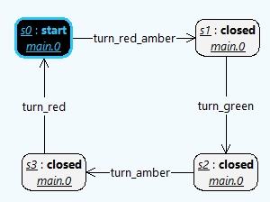
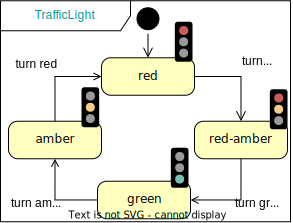

## Groove Prerequisites:
- Installed java (check with ```java -version```). Tested with version 1.8.0_301.

Run **Groove** by executing the following command in this directory:
```
java -jar ../groove-5_8_1/bin/Simulator.jar
```
Then load the example by clicking ```File < Load Grammar``` and selecting the following:
- **trafficLight.gps**

## State space generation
Using the graph grammar, one can generate the state space using Groove (Consult the Groove demos in the further resources section if needed).
The following screenshot illustrates the state space (4 States, 4 transitions) generated by Groove.



By clicking on individual states, one can see the graph associated with that state. The rules are typed in the state machine snapshot metamodel, which serves as a type graph in Groove.

The state space is identical to the state space of the traffic light state machine.



## Further resources:
- Groove Demo: [Basic functionality](https://www.youtube.com/watch?v=R2beaSQ9-NM).
- Groove Demo: [Editing Graphs and Rules](https://www.youtube.com/watch?v=R2beaSQ9-NM).
- Groove Demo: [Type Graphs](https://www.youtube.com/watch?v=LTGRS3AYSSM).

Feel free to contact me for further information.
