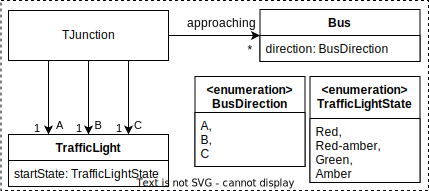
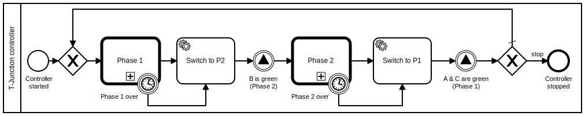
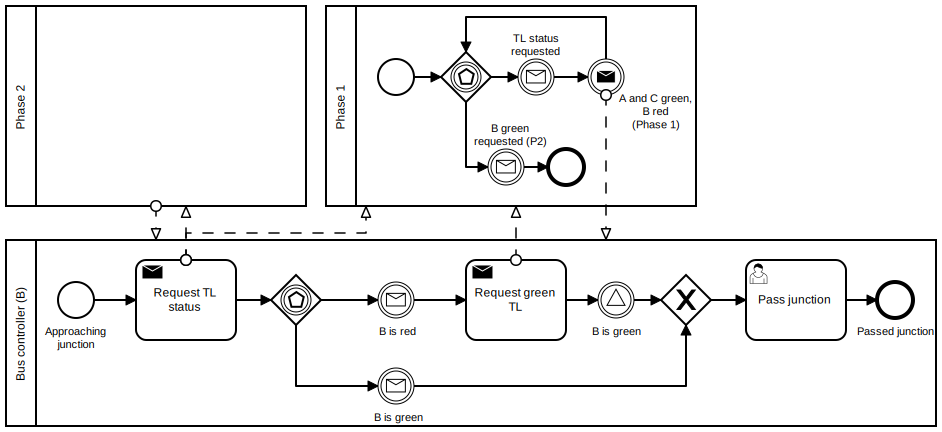
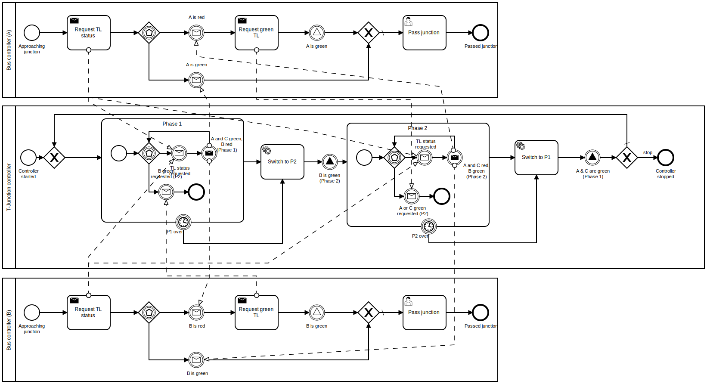

# Use case

The behavioral models of our system and their relationships are shown in the following diagram.

The behavior models are the following.

The BPMN source files are located [here](./bpmn-files).

### Run the BPMN models:
To understand how the used BPMN constructs work, you can run the BPMN models using the browser-based simulator (implemented by [bpmn.io](https://github.com/bpmn-io)).

- Go to the [BPMN simulator](https://bpmn-io.github.io/bpmn-js-token-simulation/modeler.html).
- Download the executable use case model from [here](./bpmn-files/use-case-execution.bpmn).

- Import the model into the simulator by dragging it into the browser.
- Spawn a T-Junction controller and buses by clicking on the respective start events of the processes.
- Enjoy the simulation.